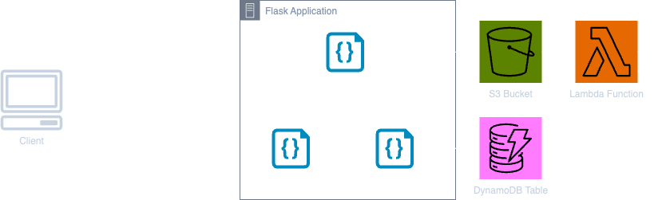

# Backend Development Exercise for the Data-Apps Team at Aidoc

## Introduction

Welcome to the backend development exercise for the Data-Apps team at Aidoc. This task is designed to evaluate your skills in backend development as they align with the Data-Apps needs, specifically with Python, Flask, AWS services (S3, DynamoDB, Lambda), and handling DICOM files. You'll be implementing key components of a backend application that processes medical imaging data.

## Table of Contents
- [Exercise Overview](#exercise-overview)
- [Project Tasks](#project-tasks)
  - [Implement Flask Endpoints](#implement-flask-endpoints)
  - [Implement `S3Manager`](#implement-s3manager)
  - [Implement `DynamoDBManager`](#implement-dynamodbmanager)
  - [Implement `DicomManager`](#implement-dicommanager)
  - [Implement AWS Lambda Function](#implement-aws-lambda-function)
  - [Testing](#testing)
- [Configuration Details](#configuration-details)
- [AWS S3 Bucket Structure](#aws-s3-bucket-structure)
- [Setting Up the Development Environment](#setting-up-the-development-environment)
  - [Prerequisites](#prerequisites)
  - [Instructions](#instructions)
- [Evaluation Criteria](#evaluation-criteria)

## Exercise Overview

In this project, you will handle DICOM files stored on AWS S3. The objective is to process these DICOM files, extract relevant metadata, and store the information in a more queryable form within DynamoDB. Additionally, you will manage various AWS services using Python code to ensure seamless integration and functionality.

You should develop a backend system that provides REST API endpoints to interact with the backend infrastructure. Internally, your system will include managers and functions to process requests, manage storage and database interactions, and handle internal computations.

We have provided deploy scripts, a project skeleton, and some partially implemented code files. Your task is to fill in the gaps and integrate these components to create a fully functional backend system.

To gain a clearer understanding of the infrastructure, we have provided a high-level schematic diagram below:


You have **approximately 3 hours** to complete this exercise, which includes:
- **2:15 - 2:30 hours** to complete the exercise.
- **30-45 minutes** reserved for you to present your work and discuss your approach.

If you require more time, please don't hesitate to ask.

## Project Tasks

### Implement Flask Endpoints
The main Flask application is written in `app.py` located at the root folder. You will find a skeleton of a Flask app with a `/health` endpoint implemented. Your task is to implement three additional endpoints:
- **`/dicom-metadata` Endpoint (GET):** Receives an `s3_path` query string parameter and returns the metadata of the file as a JSON response.
- **`/upload-json-to-s3` Endpoint (POST):** Accepts a JSON payload in the request body, generates a JSON file, and uploads it to S3 using a **pre-signed URL**. **When uploading a JSON file, ensure it is uploaded to the `json` folder using a pre-signed URL.**
- **`/fetch-dicom-metadata` Endpoint (GET):** Receives an `s3_path` query string parameter and returns the corresponding metadata stored in DynamoDB.

**Note:** You should handle errors and exceptions correctly and provide relevant responses for all use cases, including edge cases.

### Implement `S3Manager`
In the `managers` folder at the root of the project, you will find the `S3Manager.py` file. This file should manage all relevant S3 actions you need. You already have a class skeleton with the constructor implemented, which handles the connection using your `secrets.json` file. Your task is to extend this class to handle actions such as generating pre-signed URLs and uploading files using these URLs.

### Implement `DynamoDBManager`
Similarly, in the `managers` folder, you will find the `DynamoDBManager.py` file. This file should manage all interactions with DynamoDB. You are provided with an initialization function that supports both initialization with secrets and IAM role credentials. Your task is to extend this class to handle all necessary DynamoDB operations. **Try to think about why the constructor is set up this way**, as this will be a key point in understanding the project design.

### Implement `DicomManager`
In the `managers` folder, the `DicomManager.py` file is responsible for handling DICOM files. Your task is to implement the `extract_metadata(self, file_path)` method. Use the `pydicom` library to read the DICOM file directly from S3 into memory and extract the following metadata fields: `PatientID`, `StudyDate`, `Modality`, `InstitutionName`, `StudyDescription`. Return the metadata as a dictionary.

### Implement AWS Lambda Function
The Lambda function is located in the `lambda` folder as `lambda_function.py`. The Lambda trigger is already implemented and configured to activate upon successful uploads of new files to the S3 bucket. Your task is to implement the `lambda_handler(event, context)` function. This function should read the newly uploaded JSON file and store its content in DynamoDB using the `DynamoDBManager`.

**Lambda Trigger Details:**
The Lambda function is triggered by S3 events when a new JSON file is uploaded to the `json` folder. You will find all relevant information about the incoming event in the [AWS Lambda S3 Trigger Documentation](https://docs.aws.amazon.com/lambda/latest/dg/with-s3.html).


### Testing
Write tests for any function you believe is relevant. The tests should be placed in the `tests` folder.

## Configuration Details

There is a `config.py` file in the root of the project that contains the following constants: **AWS Region**, **S3 Bucket Name**, **DynamoDB Table Name**.

> **[IMPORTANT]**  
> **Do not modify the `config.py` file.**  
> You should import this configuration file wherever you need access to these constants within your code.

## AWS S3 Bucket Structure

The S3 bucket (`data-apps-ex`) has the following folder structure:

```
s3://data-apps-ex/
│ 
├── dicom/ 
│   ├── [DICOM files...] 
│ 
└── json/
```

- **`dicom/` Folder:** Contains all DICOM (`.dcm`) files.
  - **Sample DICOM File URLs for Testing:**
    - `s3://data-apps-ex/dicom/anon-1.2.826.0.1.3680043.9.6883.1.10195538163763094827724267394223630.dcm`
    - `s3://data-apps-ex/dicom/anon-1.2.826.0.1.3680043.9.6883.1.10348527089307076789500535245324780.dcm`
    - `s3://data-apps-ex/dicom/anon-1.2.826.0.1.3680043.9.6883.1.10738262318460353545837328627181716.dcm`

- **`json/` Folder:** All uploaded JSON metadata files should be placed here.

## Setting Up the Development Environment

### Prerequisites

Ensure you have the following installed:

- **Python** (version 3.9.6) – [Download Python](https://www.python.org/downloads/)
- **pip** (latest version) – [Install pip](https://pip.pypa.io/en/stable/installation/)
- **AWS CLI** (latest version) – [Download AWS CLI](https://aws.amazon.com/cli/)

### Instructions

1. **Clone the Repository:**
   ```bash
   git clone <repository-url>
   cd <repository-directory>
   ```

2. **Set Up a Virtual Environment:** It's recommended to create a virtual environment for this project to isolate dependencies.
   ```bash
   python3 -m venv venv
   source venv/bin/activate  # On Windows: venv\Scripts\activate
   ```

3. **Install Dependencies:** Once the virtual environment is activated, install the required dependencies using the provided `requirements.txt` file.
   ```bash
   pip install -r requirements.txt
   ```

4. **Place the `secrets.json` File in the Root Folder:**
   > **[IMPORTANT]**  
   > **In order to connect to AWS, you will need AWS credentials.**
   > **These credentials will be provided to you by one of our team members in a secrets.json file.**
   > **Please do not commit or copy the contents of this file.**

5. **Deploy Resources:** To deploy the necessary AWS resources, run the `deploy_resources.sh` script from the root folder using your terminal.
   ```bash
   bash deploy/deploy_resources.sh
   ```
   > **[NOTE]**  
   > Whenever you update the Lambda function code, re-run the `deploy_resources.sh` script to apply the changes.
   If needed, you can also use the `rollback_resources.sh` script, but we don't expect that you'll need it if everything works as expected.


6. **Run the Flask App:** Once everything is set up, you can start the Flask application by running the following command from the root folder:
   ```bash
   python app.py
   ```

7. **Check the Application:** To verify that the application is running correctly, you can use Postman or any other method. You also have an implemented health check endpoint:
   ```bash
   curl http://localhost:5000/health
   ```

8. **Run Tests:** To run the tests, execute the following command from the project root:
   ```bash
   pytest
   ```

## Evaluation Criteria

The end goal is to submit a pull request with the code you wrote.

Your submission will be evaluated based on the following:

- **Functionality:** Everything should work according to the instructions.
- **Code Clarity and Organization:** Clean, well-organized, and easy-to-understand code.
- **Use of Git:** Organized commits with explanatory messages and effective branch management.
- **Code Design and Architecture:** Demonstrates good design and architectural decisions.
- **Testing:** The implemented tests should pass successfully and cover key functionalities.
- **Best Practices:** Adherence to best practices in backend development, including Flask API design and AWS integration.
- **Understanding of Infrastructure:** Most of the heavy-duty infrastructure establishment is taken care of for you. However, it will be a huge bonus if you can explain how and what happens during deployment and usage of these services.

We will be here to assist and provide any help you need.
Don't hesitate to call us if you have even the smallest doubt or question. We’re here to help you succeed!

**Good Luck!**